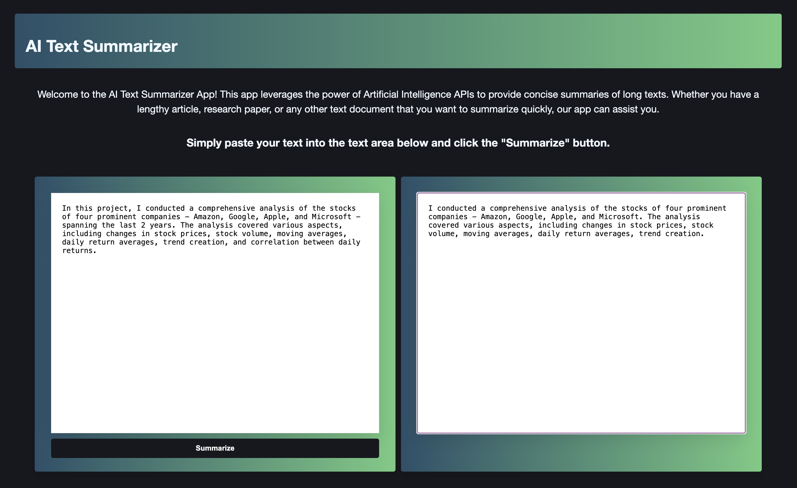

# AI Text Summariser using HuggingFace

## About

In this project, I created a Text Summarizer webpage using Hugging Face's clever tools. I tapped into Facebook’s “bart-large-cnn” model, which is a super-smart language expert trained just for summarizing text. To facilitate testing, I leveraged Postman and even utilized its code generation feature for API calls.

## Structure

Our webpage has a client-side, server-side and external integration to HuggingFace.

- Front end: uses HTML, CSS and JavaScript. 
- Back end: uses Node.js, Express and Hugging Face Inference API.
- API Platform: Postman

## Screenshot

## Conclusion

While this project may seem modest with its simple web UI, it packs a punch in terms of knowledge gained. Exploring API usage and integration with both client and server sides has been a valuable learning experience. This knowledge serves as a solid foundation for future endeavors, especially when deploying and utilizing my own ML model APIs.
