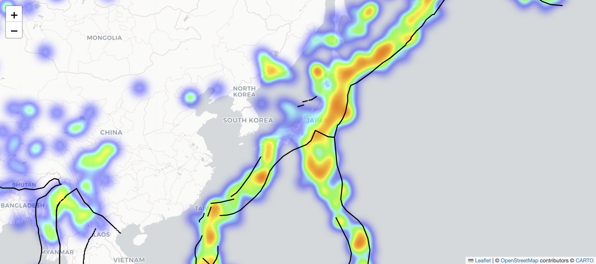
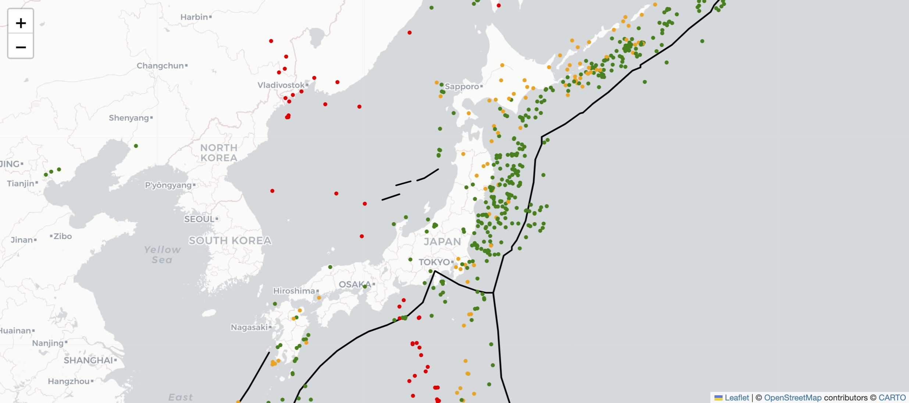
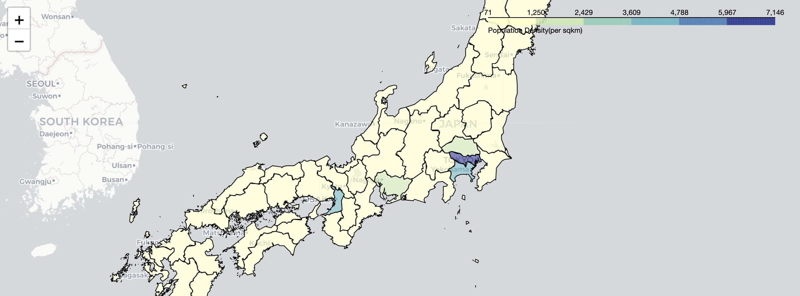
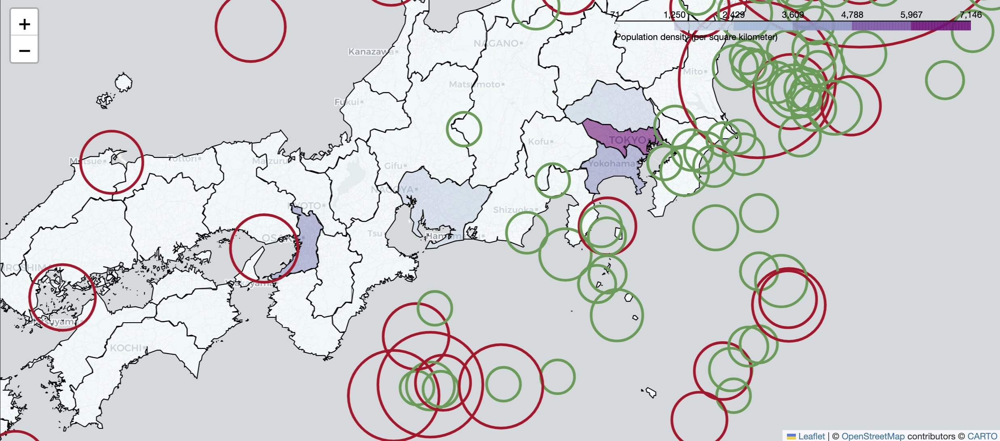

# Japan Earthquake Reinforcement Analysis

## Overview

In this project, I conducted a comprehensive analysis of Japan's earthquake data to provide recommendations for prefectures that require additional earthquake reinforcement measures. Leveraging geospatial data obtained from Kaggle, I utilized the geopandas library to visualize and analyze various aspects of seismic activity in Japan.

## Key Analyses

### Plate Boundaries and Earthquakes

I investigated the correlation between earthquake occurrences and plate boundaries. This analysis aimed to identify whether seismic activities coincide with specific plate boundaries. Additionally, I explored if there is a relationship between plate boundaries and the depth of earthquakes.

### Population Density Analysis

To understand the potential impact of earthquakes on populated areas, I analyzed the density of population in different prefectures. This analysis aids in identifying regions where earthquake reinforcement measures may be particularly crucial due to higher population density.

### Magnitude and Severity

An examination of earthquake magnitude and severity was conducted. This analysis involved studying the distribution of earthquake magnitudes and assessing the severity of seismic events. The goal was to identify prefectures with a history of more severe earthquakes.

## Visualisations

- Leveraging Folium's heatmap and polyline features, I created an interactive map illustrating the coincidence between earthquakes and plate boundaries in Japan.

  

- Employing Folium's polyline and Circle functionalities, I visually depicted plate boundaries and their proximity to earthquake depths, offering insights into potential seismic correlations.

- Utilizing Folium's chloropleth map, I showcased the population density across different prefectures, providing a clear visualization of densely populated areas.

- Combining Folium's chloropleth and Circle features, I mapped population density with markers indicating the magnitude of earthquakes, offering a comprehensive view of seismic activity in relation to population centers.

## Data Source

**Kaggle**: The project utilized geospatial data from Kaggle, including earthquake data and information on plate boundaries.

## Python Libraries used

- Geopandas: Geopandas is a Python library extending Pandas to handle geospatial data, providing data structures and spatial operations for efficient geospatial analysis.
- Folium: Folium is a Python library that simplifies the creation of interactive Leaflet maps for visualizing geospatial data in web applications.
- Pandas: 

## Conclusion

Based on the analyses conducted from the available earthquake data in Japan, the following conclusions were drawn:

- Earthquakes tend to align with specific plate boundaries.
- The depth of earthquakes may have correlations with certain plate boundaries.
- Prefectures with higher population density may require additional earthquake reinforcement.
- Understanding the distribution of earthquake magnitudes helps in identifying regions with a history of more severe seismic activity.

**Prefectural Insights:**

- Tokyo, the most densely populated prefecture, has experienced earthquakes, but they were relatively weaker compared to Yokohama and Osaka.
- Osaka, although less densely populated, experienced a relatively stronger earthquake than those near Tokyo.
- Yokohama, with its high density and historical proximity to strong earthquakes, poses added potential tsunami risk.

**Recommendations:**

- **Yokohama and Osaka:** Recommend additional earthquake reinforcement due to their experience with strong earthquakes and proximity to each other.
- **Tokyo:** Despite its high population density, the recommendation for extra earthquake reinforcement is not prioritized as it has experienced weaker earthquakes compared to Yokohama and Osaka.

This analysis provides valuable insights for earthquake reinforcement strategies in Japan, contributing to the overall preparedness and safety of the affected regions. For a detailed walkthrough of the analyses and visualizations, explore the Jupyter Notebook in this repository.
