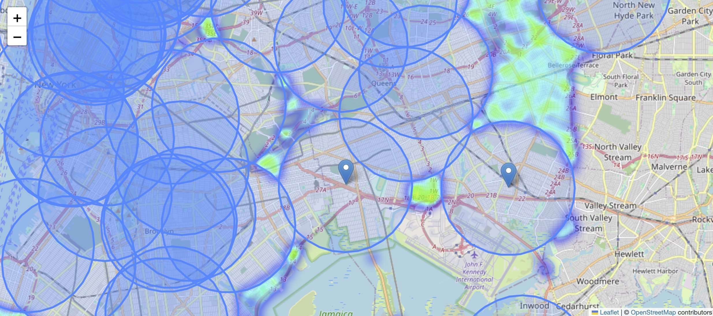

# NYC Hospital Placement Optimization

## Project Overview

Assumming I'm a member of the crisis response team, this project focuses on optimizing hospital locations in New York City to improve response times to motor vehicle collisions. The analysis utilizes collision data from 2013 to 2018, aiming to identify locations for two new hospitals to bring down the percentage of collisions occurring more than 10 kilometers away from the closest hospital to less than ten percent.

## Data Sources

The project utilizes motor vehicle collision data sourced from Kaggle, tracking incidents in New York City from 2013 to 2018. The dataset provides valuable information on collision locations, facilitating a comprehensive analysis to optimize hospital placements.

## Visualizations

**1. Collision Data Visualization**

Visualized motor vehicle collision data on an interactive map using the latitude and longitude information. Each marker represents a collision incident.


**2. Hospital Location Visualization**

Mapped existing hospital locations using latitude and longitude information.

**3. Hospital Coverage and Collisions Heatmap**

Visualized hospital coverage areas and collisions occurring more than 10 kilometers away from the closest hospital using GeoJson, HeatMap, and LatLngPopup.

**4. New Hospital Placement Visualization**

Utilized the new_hospital function to visualize proposed hospital locations, coverage, and the corresponding heatmap.

## Analysis and Recommendations

**Percentage Reduction Goal**

The objective was to reduce the percentage of collisions occurring more than 10 kilometers away from the closest hospital to less than ten percent. The initial analysis revealed a percentage of 15.12%.

**Recommender System**

Developed a recommender system to identify the closest hospital for a given crash location, aiding in efficient transportation of injured individuals.

```python
def best_hospital(collision_location):
    distances = hospitals.geometry.distance(collision_location)
    name = hospitals.iloc[distances.idxmin()]['name']
    return name
```

**New Hospital Placement**

Experimented with different locations and recommended two new hospitals at coordinates (40.6714, -73.8492) and (40.6702, -73.7612). This strategic placement brought down the percentage to 9.12%.

```python
# function to check if new hospital locations will get the percentage of collisions more than 10km to <10%
def new_hospital(lat_1, long_1, lat_2, long_2):
    new_df = pd.DataFrame(
        {'Latitude': [lat_1, lat_2],
         'Longitude': [long_1, long_2]})
    new_gdf = gpd.GeoDataFrame(new_df, geometry=gpd.points_from_xy(new_df.Longitude, new_df.Latitude))
    new_gdf.crs = {'init' :'epsg:4326'}
    new_gdf = new_gdf.to_crs(epsg=2263)
    # get new percentage
    new_coverage = gpd.GeoDataFrame(geometry=new_gdf.geometry).buffer(10000)
    new_my_union = new_coverage.geometry.unary_union
    new_outside_range = outside_range.loc[~outside_range["geometry"].apply(lambda x: new_my_union.contains(x))]
    new_percentage = round(100*len(new_outside_range)/len(collisions), 2)
    print("(NEW) Percentage of collisions more than 10 km away from the closest hospital: {}%".format(new_percentage))
    # make the map
    m = folium.Map(location=[40.7, -74], zoom_start=11) 
    folium.GeoJson(coverage.geometry.to_crs(epsg=4326)).add_to(m)
    folium.GeoJson(new_coverage.geometry.to_crs(epsg=4326)).add_to(m)
    for idx, row in new_gdf.iterrows():
        Marker([row['Latitude'], row['Longitude']]).add_to(m)
    HeatMap(data=new_outside_range[['LATITUDE', 'LONGITUDE']], radius=9).add_to(m)
    folium.LatLngPopup().add_to(m)
    display(embed_map(m, 'q_6.html'))
```

## Python Libraries used

- Geopandas: Geopandas is a Python library extending Pandas to handle geospatial data, providing data structures and spatial operations for efficient geospatial analysis.
- Folium: Folium is a Python library that simplifies the creation of interactive Leaflet maps for visualizing geospatial data in web applications.
- Pandas
- shapely: shapely is a Python library for geometric operations and manipulations, particularly useful for working with spatial data.

## Conclusion

By strategically placing two new hospitals at the proposed locations, the project aims to significantly reduce the percentage of collisions occurring more than 10 kilometers away from the closest hospital. This proactive approach emphasizes the potential to save lives by improving emergency response times. The data-driven analysis spans from 2013 to 2018, providing valuable insights for optimizing healthcare services in New York City.

#### Proposed location of new hospitals

- Latitude: 40.6714, Longitude: -73.8492
- Latitude: 40.6702, Longitude: -73.7612

