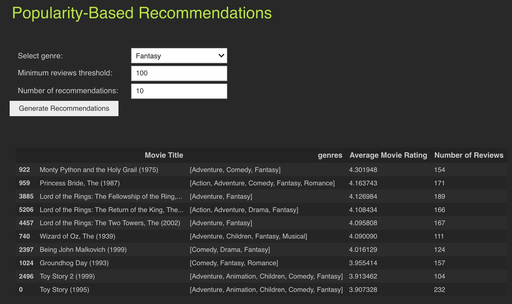
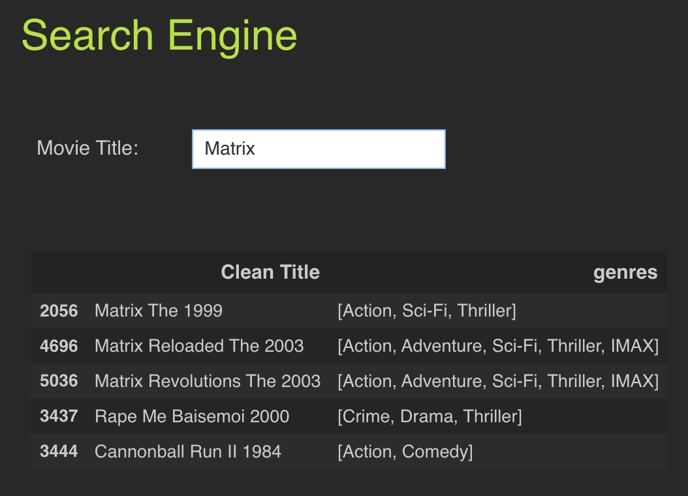
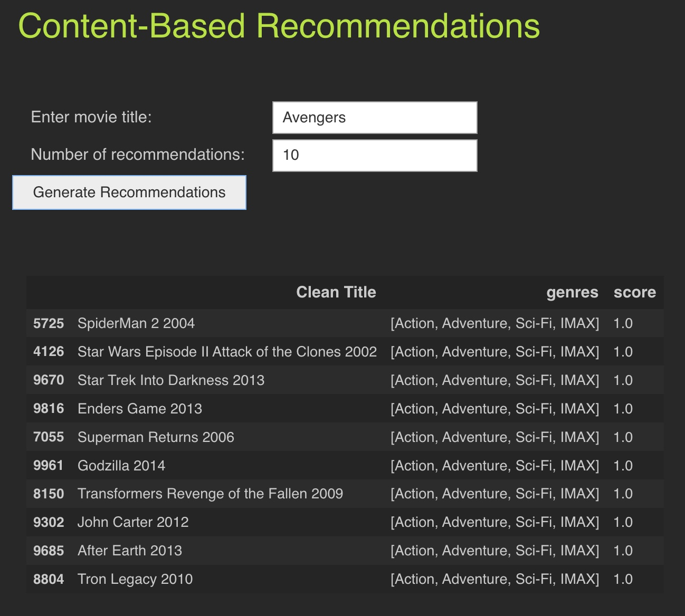
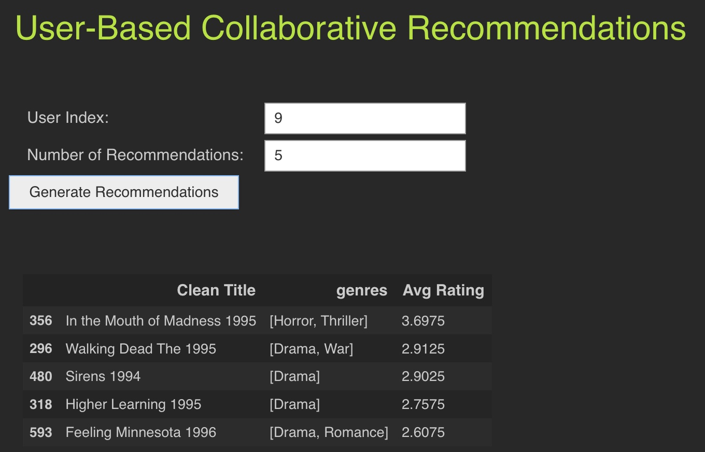

# Simple Movie Recommender System      

This repository contains a simple movie recommender system implemented using different approaches, including popularity-based, content-based, user-based collaborative filtering, and item-based collaborative filtering. The system utilizes cosine similarities to make recommendations.             

## Approaches Implemented       

1. **Popularity-Based Recommender**: This approach recommends movies based on their overall popularity among users. It suggests popular movies regardless of user preferences.
2. **Content-Based Recommender**: This approach recommends movies similar to a given movie based on genre.
3. **User-Based Collaborative Filtering**: This approach recommends movies to a user based on similar users' preferences. It calculates the cosine similarity between users' ratings and suggests movies liked by similar users.
4. **Item-based Collaborative Filtering**: This approach recommends movies similar to those previously liked by a user. It calculates the cosine similarity between movies based on user ratings and suggests similar movies to those the user has rated highly.

## Implementation

- The recommender system is implemented in Python using pandas and scikit-learn libraries.
- Cosine similarity is used as the similarity metric for computing similarities between movies or users.

## About Dataset

### Context
- GroupLens Research has collected and made available rating data sets from the MovieLens web site (http://movielens.org). The data sets were collected over various periods of time, depending on the size of the set.
- A recommender system is a simple algorithm whose aim is to provide the most relevant information to a user by discovering patterns in a dataset. The algorithm rates the items and shows the user the items that they would rate highly.

### Content
- The data consists of 105339 ratings applied over 10329 movies. The average rating is 3.5 and minimum and maximum rating is 0.5 and 5 respectively. There are 668 user who has given their ratings for 149532 movies.

Link: [Dataset Link Kaggle](https://www.kaggle.com/datasets/ayushimishra2809/movielens-dataset?resource=download)

## Code

### 1. popularity_recommender
- description: generates popularity-based recommendations depending on input genre
- params:
  - `genre` - specific genre
  - `threshold` - min. number of reviews
  - `nums` - number of recommendations
- returns: Dataframe with top nums recommendations

```python
def popularity_recommender(genre, threshold, nums):
    result = popularity[popularity[genre] == 1]  # filter movies with the given genre
    result = result[result['Number of Reviews'] > threshold]  # filter movies with a minimum number of reviews
    result = result.sort_values(by='Average Movie Rating', ascending=False)[:nums]  # sort movies by average rating and select top n
    return result
```



### 2. search_title
- description: searches for similar titles based on input using cosine similarity between the TF-IDF matrix and the input title
- params:
  - `title` - movie title for search
- returns: Dataframe with top 5 similar results

```python
def search_title(title):
    title = clean_title(title) # clean the input title
    query_vec = vectorizer.transform([title]) # transform the input title into a TF-IDF vector
    similarity = cosine_similarity(query_vec,tfidf).flatten() #  calculate the cosine similarity between the input title and all movie titles
    indices = similarity.argsort()[::-1][:5] # sort the similarity scores in descending order and select the top 5 indices
    results = movies.iloc[indices] # get the movie titles corresponding to the top 5 indices
    return results
```



### 3. content_recommender
- description: generates recommendations based on the similarity of the movie's genres with input movie genre
- params:
  - `movie_id` - movieId extracted from `search_title`
  - `nums` - number of recommendations
- returns: Dataframe with top nums recommendations

```python
def content_recommender(movie_id, nums):
    similar_movies_indices = movies_similarity[movie_id].argsort()[::-1][:nums] # nums most similar movies indices to the input movie
    similar_movies = movies.loc[similar_movies_indices] # getting the movie titles from the indices
    similar_movies["score"] = movies_similarity[movie_id][similar_movies_indices] # getting the movie scores from the indices
    return similar_movies[['Clean Title', 'genres', 'score']]
```



### 4. user_collaborative_recommender
- description: generates recommendations based on the similarity of the users calculated by their movie ratings
- params:
  - `user_index` - index of the user to be used for filtering
  - `top_n` - number of recommendations
- returns: Dataframe with top top_n recommendations

```python
def user_collaborative_recommender(user_index,top_n):
    similar_user = user_similarity[user_index].argsort()[::-1][1:200+1] # get the indices of the top 200 similar users
    min_num_reviews = popularity.index[popularity['Number of Reviews'] > 100].tolist() # get the indices of movies with more than 100 reviews
    similar_user_ratings = movie_mat.iloc[similar_user, min_num_reviews] # get the ratings of the top 200 similar users for the movies with more than 100 reviews
    average_mov_rating = similar_user_ratings.mean(axis=0) # calculate the average rating of the movies by the 200 similar users
    top_n_indices = average_mov_rating.sort_values(ascending=False)[:top_n].index.tolist()  # get the indices of the top n movies with the highest average rating
    recommendations =  movies[['Clean Title', 'genres']].loc[top_n_indices]  # get the titles and genres of the top n movies with the highest average rating
    recommendations['Avg Rating'] = average_mov_rating[top_n_indices].tolist()  # add the average rating of the movies to the recommendations
    return recommendations
```



### 5. item_collaborative_recommender
- description: generates recommendations using item-based collaborative filtering by identifying similar users and selecting movies watched by them
- params:
  - `movie_id` - movieId extracted from `search_title`
  - `nums` - number of recommendations
-returns: Dataframe with top nums recommendations

```python
def item_collaborative_recommender(movie_id, nums):
    similar_users_new = ratings[(ratings["movieId"] == movie_id) & (ratings["rating"] > 4)]["userId"].unique()  # find similar users who watched the input movie and rated it higher than 4
    similar_users_recs = ratings[(ratings["userId"].isin(similar_users_new)) & (ratings["rating"] > 4)]["movieId"]  # find the other movies that the simialr users have watched and rated it higher than 4
    
    similar_users_recs = similar_users_recs.value_counts() / len(similar_users_new)  #percentage of similar users that watched the movies
    similar_users_recs = similar_users_recs[similar_users_recs > 0.10] #getting the movies that were watched by more than 10% of the similar_users
    
    all_users = ratings[(ratings["movieId"].isin(similar_users_recs.index)) & (ratings["rating"] > 4)] # find the percentage of all users that have watched the same movies as similar users and rated it higher than 4
    all_users_recs = all_users["movieId"].value_counts() / len(all_users["userId"].unique()) # find the percentage of all users that have watched the same movies as similar users and rated it higher than 4
    
    rec_percentages = pd.concat([similar_users_recs, all_users_recs], axis=1)  # concat the percenatges of users of similar users and all users that have watched the movies
    rec_percentages.columns = ["similar", "all"]  # rename the columns
    
    rec_percentages["score"] = rec_percentages["similar"] / rec_percentages["all"]  # finding the ratio of similar and all percentages
    
    rec_percentages = rec_percentages.sort_values("score", ascending=False)  # sort the ratio(score) in descending order
    
    return rec_percentages.head(nums).merge(movies_new, left_index=True, right_on="movieId")[["title","genres","score"]]
```


